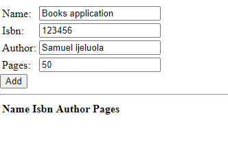

## MEAN STACK DEPLOYMENT TO UBUNTU IN AWS

*Install NodeJs*

I installed Node.js in order to configure Express routes and Angular JS controllers. But first, I used the `sudo apt update` and sudo apt upgrade' scripts to update and upgrade my Ubuntu server before installing Node.js. The results of the two activities were shown in the photographs below, respectively.

The commands `sudo apt -y install curl dirmngr apt-transport-https lsb-release ca-certificates and curl -sl https://deb.nodesource.com/setup 12.x | sudo -E bash | sudo -E bash -` were used to add certificates to the server after it had been updated and upgraded, and their respective outputs are shown in the images below.

I installed Node.js using the command `sudo apt install -y nodejs` after adding the certificates, and the output produced is seen in the image below:

After installing nodejs, I looked for npm but it wasn't there so I had to install it. The node and npm versions are displayed below.

*Install MongoDB*

I set up MongoDB to store documents that resemble JSON because the database's fields can vary from document to document and the data's structure can also occasionally change. MongoDB saves data in a flexible manner. I added book records to MongoDB for this application that provide the book's name, ISBN, author, and page numbers.

I added a gpg key before installing MongoDB by running the command:

At the command line, type `sudo apt-key adv —keyserver hkp:/keyserver.ubuntu.com:80 —recv 0C49F3730359A14518585931BC711F9BA15703C6`. and the results are shown below:

The command echo "deb [arch=amd64] https://repo.mongodb.org/apt/ubuntu trusty/mongodb-org/3.4 multiverse" | sudo tee /etc/apt/sources.list.d/mongodb-org-3.4.list was used to add mongodb list after adding the key:

I installed mongodb by typing `sudo apt install -y mongodb` after the keys had been added, and the result is seen in the output in the image below:

Following the service's launch, I used the commands `sudo service mongodb start` and `sudo systemctl status mongodb` to examine the installation's progress. The results are shown in the image below:

By issuing the command `sudo npm install body-parser` once the status had been checked and everything appeared to be in order, the output shown below was produced. I installed the body-parser package to assist me in processing the JSON files sent in request to the server.

So, using the command `sudo mkdir`, I made a folder called Books, then used the command `npm init` to open the folder and start the npm project. Below is a display of the result:

After this has been done, I created a file named server.js with command `sudo touch server.js` and opened it with command `sudo vi server.js` and then wrote the scritp below into it:

`var express = require('express');
var bodyParser = require('body-parser');
var app = express();
app.use(express.static(__dirname + '/public'));
app.use(bodyParser.json());
require('./apps/routes')(app);
app.set('port', 3300);
app.listen(app.get('port'), function() {
    console.log('Server up: http://localhost:' + app.get('port'));
});`
## INSTALLING EXPRESS AND SETTING ROUTES TO THE SERVER

I set up Express, an adaptable Node.js web application framework, to add functionalities to the application. By doing this, it will be easier to transfer book data to and from the MongoDB database.

Additionally, the mongoose package will be installed to offer a simple, schema-based way to represent the application data. This will produce a database structure for the book registration data.

I used the command `sudo npm install express mongoose` to install Express with the mongoose package, and the results are shown below:

After that, I made a new folder called app and a file called routes.js. The graphic below shows that every instruction was executed.

In side the routes file, I wrote the script shown below:

`var Book = require('./models/book');
module.exports = function(app) {
  app.get('/book', function(req, res) {
    Book.find({}, function(err, result) {
      if ( err ) throw err;
      res.json(result);
    });
  }); 
  app.post('/book', function(req, res) {
    var book = new Book( {
      name:req.body.name,
      isbn:req.body.isbn,
      author:req.body.author,
      pages:req.body.pages
    });
    book.save(function(err, result) {
      if ( err ) throw err;
      res.json( {
        message:"Successfully added book",
        book:result
      });
    });
  });
  app.delete("/book/:isbn", function(req, res) {
    Book.findOneAndRemove(req.query, function(err, result) {
      if ( err ) throw err;
      res.json( {
        message: "Successfully deleted the book",
        book: result
      });
    });
  });
  var path = require('path');
  app.get('*', function(req, res) {
    res.sendfile(path.join(__dirname + '/public', 'index.html'));
  });
};`

I made a directory named models inside the app folder, and then I added a book.js file to it. I accessed the book.js file and added the following script:

`var mongoose = require('mongoose');
var dbHost = 'mongodb://localhost:27017/test';
mongoose.connect(dbHost);
mongoose.connection;
mongoose.set('debug', true);
var bookSchema = mongoose.Schema( {
  name: String,
  isbn: {type: String, index: true},
  author: String,
  pages: Number
});
var Book = mongoose.model('Book', bookSchema);
module.exports = mongoose.model('Book', bookSchema);`

## ACCESS THE ROUTES WITH ANGULARJS

I made an AngularJS access to link the web page to Express and perform operations on the book register. The following actions were done to accomplish this:

I made a script.js file and put the script below it after making a directory called public inside the Books folder.

`var app = angular.module('myApp', []);
app.controller('myCtrl', function($scope, $http) {
  $http( {
    method: 'GET',
    url: '/book'
  }).then(function successCallback(response) {
    $scope.books = response.data;
  }, function errorCallback(response) {
    console.log('Error: ' + response);
  });
  $scope.del_book = function(book) {
    $http( {
      method: 'DELETE',
      url: '/book/:isbn',
      params: {'isbn': book.isbn}
    }).then(function successCallback(response) {
      console.log(response);
    }, function errorCallback(response) {
      console.log('Error: ' + response);
    });
  };
  $scope.add_book = function() {
    var body = '{ "name": "' + $scope.Name + 
    '", "isbn": "' + $scope.Isbn +
    '", "author": "' + $scope.Author + 
    '", "pages": "' + $scope.Pages + '" }';
    $http({
      method: 'POST',
      url: '/book',
      data: body
    }).then(function successCallback(response) {
      console.log(response);
    }, function errorCallback(response) {
      console.log('Error: ' + response);
    });
  };
});`

In the public folder, I also made another file with the name index.html and added the script below to it.

`<!doctype html>
<html ng-app="myApp" ng-controller="myCtrl">
  <head>
    
    
  </head>
  <body>
    

      <table>
        <tr>
          <td>Name:</td>
          <td><input type="text" ng-model="Name"></td>
        </tr>
        <tr>
          <td>Isbn:</td>
          <td><input type="text" ng-model="Isbn"></td>
        </tr>
        <tr>
          <td>Author:</td>
          <td><input type="text" ng-model="Author"></td>
        </tr>
        <tr>
          <td>Pages:</td>
          <td><input type="number" ng-model="Pages"></td>
        </tr>
      </table>
      <button ng-click="add_book()">Add</button>
    

    

    

      <table>
        <tr>
          <th>Name</th>
          <th>Isbn</th>
          <th>Author</th>
          <th>Pages</th>

        </tr>
        <tr ng-repeat="book in books">
          <td>{{book.name}}</td>
          <td>{{book.isbn}}</td>
          <td>{{book.author}}</td>
          <td>{{book.pages}}</td>

          <td><input type="button" value="Delete" data-ng-click="del_book(book)"></td>
        </tr>
      </table>
    

  </body>
</html>`

After completing this, I launched the server using the `sudo node server.js` command and checked my browser for the desired results, as shown below:

All the adjustments performed in the browser were immediately mirrored on my server, confirming that my configurations, as shown in the following image, were accurate:

